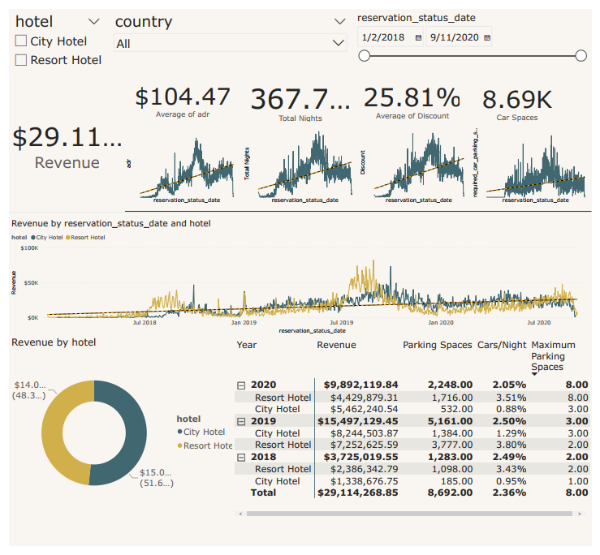

# Hotels-Revenue-dashboard

This Power Bi dashboard fulfills the next requirements:
## Requirements


The data used to build this dashboard was in excel file "hotel_revenue_historical_full" which contains 5 sheets.\
To analyze the data, I built a database with the data. then I imported the data from the SQL server using the following query.
```bash
WITH hotels_reservations as(
SELECT * FROM dbo.['2018$']
UNION
SELECT * FROM dbo.['2019$']
UNION
SELECT * FROM dbo.['2020$'])

SELECT * FROM hotels_reservations
LEFT JOIN dbo.market_segment$
ON hotels_reservations.market_segment = dbo.market_segment$.market_segment
LEFT JOIN dbo.meal_cost$
ON hotels_reservations.meal = meal_cost$.meal
```
## Screenshot of the dashboard

Some measures have been created in Power Bi to make the following dashboard can be seen in the Power Bi file.\

## Authors

- [@Tarek Habash](https://github.com/tarek797)

